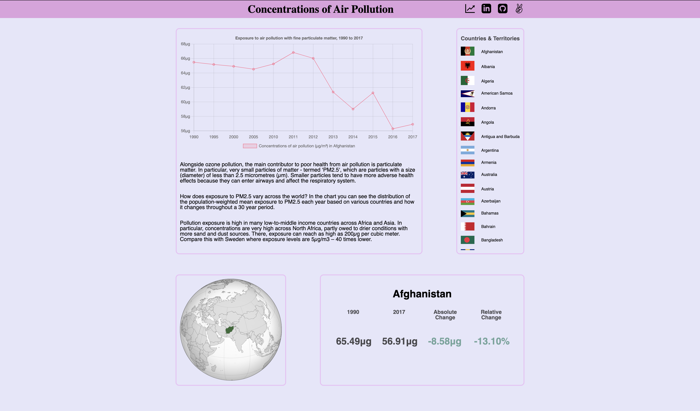

# PM25

Welcome to PM25! PM25 is a interactive data Javascript project that details the various concentrations of Air Pollution across the Globe. In it you can view the fine particulate matter - termed 'PM2.5' and how exposed each country is around a 30 year span (1990 to 2017).


<a href="" style="text-align: center; display: block; margin: 0 auto;">Live Link</a>

# Features

There is an interactive graph based on which country/territory you click to view. Once a country is selected, it will fetch the data and using canvas it will draw up data and display it.

There is also a interactive globe and data which shows the absolute change and relative change over the 30-year period.

## Tablet Devices


## Mobile Devices


# Key functions and logic

Everytime a user clicks on a new country, the previous chart gets destroyed and a new chart gets created while updating the data needed to match the new country being clicked. We are also fetching the ID and adding a event listener to make sure there are no errors.

```javascript
function createChartForCountry() {
  arrayOfCountries.forEach((country) =>
    document
      .getElementById(country.replace(/ /g, ""))
      .addEventListener("click", (e) => {
        e.preventDefault();
        if (myChart) {
          myChart.destroy();
        }
        createChart(country);
      })
  );
}
```

The chart is created using chartJS a javascript library which handles the data and draws the chart in a canvas element.

```javascript
myChart = new Chart(ctx, {
  type: "line",
  data: {
    labels: data.xlabels,
    datasets: [
      {
        label:
          "Concentrations of air pollution (µg/m³) in " + data.countryName[0],
        data: data.ypm25,
        backgroundColor: "rgba(255, 99, 132, 0.2)",
        borderColor: "rgba(255, 99, 132, 1)",
        borderWidth: 1,
      },
    ],
  },
  options: {
    plugins: {
      title: {
        display: true,
        text: "Exposure to air pollution with fine particulate matter, 1990 to 2017",
      },
      legend: {
        position: "bottom",
      },
    },
    scales: {
      y: {
        ticks: {
          callback: function (value, index, values) {
            return value + "µg";
          },
        },
      },
    },
  },
});
```

# Technologies used

- javascript to handle most of the logic of getting information to the page
- Vanilla JS and DOM manipulation to handle HTML element interactions
- Canvas API and ChartJS to handle chart information and interactions
- Scss for styling purposes
- Webpack and Bable.JS to transpile scripts for efficiency

# Future Plans

- Add additional information for more interactivity
- Add a search/filter for the country/territory list
- Add countries interactivity
- Use D3JS for better interactivity

# Credit:

- Data and information were obtained from: https://ourworldindata.org/outdoor-air-pollution
- Globe Map and Country Flags were obtained from: https://www.wikipedia.org/
